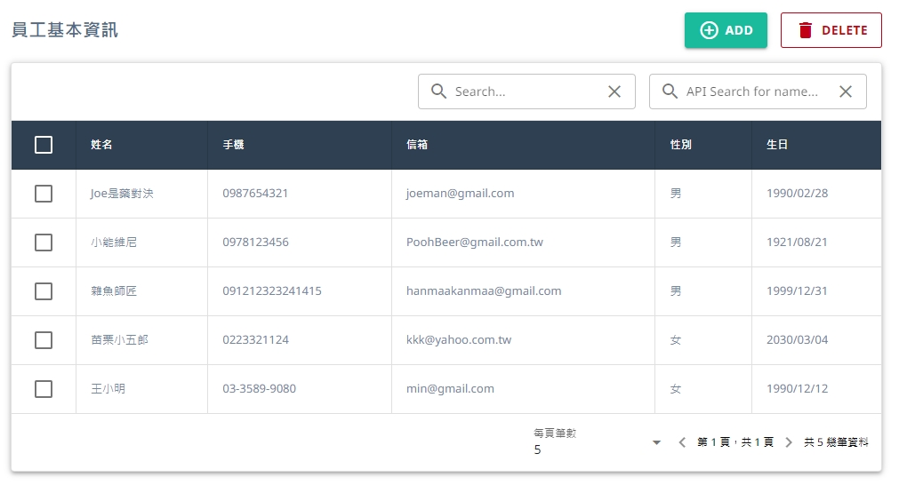

<h1 align="center">Quasar Data Table</h1>

  
  
  

## 📄 Description

This project utilizes Quasar as the build tool, Vue3 as the front-end framework, and combines them to create a highly customizable data table application. Quasar is a versatile framework that supports various front-end application development, and its flexibility allows developers to quickly build their own data table applications and customize them as needed.

## 📋 Project Structure

1. Sorting: Supports sorting, helping users quickly analyze data.
2. Filtering: Supports filtering for each column, allowing users to filter data according to their needs.
3. Pagination: Supports customizing the number of items displayed per page for paginated data display.

## 🚀 Features

- The page is developed with Vue.js framework.
- Use Quasar Table as the data table library, implementing a variety of table features.
- There is no database required.

## 📦 Setup & Development Server

1. Run `npm i` or `npm install` to install the Node.js dependencies.
2. Run `npm run dev` to run server. Server is listening on localhost:5173.
3. Open `http://localhost:8080/` in your browser.
